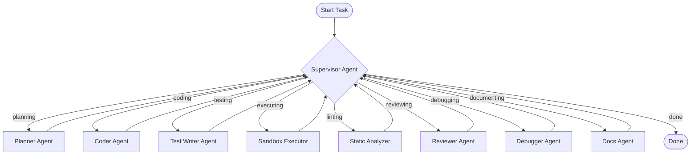

# Multi-Agent Coding Assistant

A production-ready supervised multi-agent orchestrator where specialized LLM agents collaborate via a LangGraph state graph to plan, write, test, debug, lint, and document Python projects. It runs generated code inside a secure, resource-constrained Docker sandbox and provides a live React-based monitoring dashboard.

---

## 1. System Architecture & Routing Graph

The orchestrator utilizes a **Supervisor Pattern** where a central router decides the next specialist agent based on the current workspace state.



### Specialist Agent Roster
1.  **Supervisor**: Inspects graph state (tests passed? lint errors? review blocks?) and determines the next node to execute.
2.  **Planner**: Dissects the user spec and drafts a modular multi-file architecture plan (files, classes, responsibilities).
3.  **Coder**: Writes/refines a single file at a time, looking at existing workspace code to ensure import alignment.
4.  **Test Writer**: Generates standard `pytest` unit test suites covering both the happy paths and edge cases.
5.  **Executor**: Runs the tests inside a sandboxed Docker container (with strict memory/CPU/time/network constraints).
6.  **Static Analyzer**: Runs static code analysis (`ruff`, `mypy`, `bandit`) and feeds issues back to state.
7.  **Reviewer**: Iterates on code quality, generating severity-tagged blocker and suggestion notes.
8.  **Debugger**: Receives stack traces/test outputs on failure and writes targeted code corrections.
9.  **Docs Agent**: Generates final project `README.md` and docstrings once all quality gates pass.

---

## 2. Core Capabilities

### Resumability & SQLite Checkpointing
Orchestration runs are backed by a persistent `SqliteSaver` in `checkpoints.db`. If a run fails or is aborted:
*   The exact state of the last completed node is preserved.
*   The execution can be resumed from the CLI or the UI using the same `thread_id` without losing progress.

### Isolated Docker Sandbox
Code execution is insulated from the host process inside a `python:3.12-slim` container:
*   `network_disabled=True` blocks outbound internet access.
*   Enforced memory limit of `64m` and a hard timeout (15s) prevents infinite loops or resource starvation.

### React + Tailwind CSS Dashboard
A sleek dark-mode dashboard (served directly by FastAPI) that displays:
*   A live stepper tracking agent transitions.
*   Real-time streaming logs (via Server-Sent Events) capturing agent reasoning.
*   A workspace file tree explorer and a syntax-highlighted code viewer.

---

## 3. Rate-Limiting & Network Resilience

To stay within the free-tier Gemini API rate limits (20 Requests Per Minute), the orchestrator implements:
*   **Proactive Pacing**: A mandatory **4.0-second delay** immediately before every LLM API call.
*   **Adaptive Backoff**: Exponential backoff retry loops on `RESOURCE_EXHAUSTED (429)` rate limits, parsing the API-recommended sleep duration (e.g. `Please retry in 37s`) and sleeping for that exact period + safety buffer.
*   **DNS & Socket Resilience**: Retries on transient network/DNS resolution faults (e.g., `getaddrinfo` socket errors) with a 5-second backoff sleep.
*   **Fast-Fail on Daily Quota**: If the daily request quota is exceeded (`GenerateRequestsPerDayPerProjectPerModel-FreeTier`), the system immediately fails the run rather than wasting sleep cycles.

---

## 4. Evaluation Benchmark Results

The system includes a sequential evaluation harness in `benchmark.py` running against the real Gemini API (`MOCK_LLM=false`).

### Task 3 Multi-File Specification
Unlike simple coding pipelines, **Task 3** exercises multi-file generation:
*   `schema.py`: Schema format classes.
*   `validator.py`: Logic validating column types, column counts, and headers.
*   `exceptions.py`: Shared validation exception classes.
*   Unit tests checking column mismatches, valid rows, and invalid types.

### Benchmark Run Metrics
Below is the honest execution report generated when the benchmark run hit the daily API quota:

| Task ID | Task Name | Status | Iterations | Time (s) | File Count | Primary Failure Reason |
|---|---|---|---|---|---|---|
| `task_1_lru_cache` | LRU Cache | ❌ FAILED | 4 | 40.31 | 0 | `RESOURCE_EXHAUSTED (429)` quota limit in Supervisor |
| `task_2_rate_limiter` | Token Bucket Rate Limiter | ❌ FAILED | 2 | 40.02 | 0 | `RESOURCE_EXHAUSTED (429)` quota limit in Supervisor |
| `task_3_csv_validator` | Multi-File CSV Validator | ❌ FAILED | 2 | 41.31 | 0 | `RESOURCE_EXHAUSTED (429)` quota limit in Supervisor |
| `task_4_run_length_encoder` | Run-Length Encoder | ❌ FAILED | 2 | 40.50 | 0 | `RESOURCE_EXHAUSTED (429)` quota limit in Supervisor |
| `task_5_markdown_to_html` | Markdown to HTML Converter | ❌ FAILED | 2 | 40.91 | 0 | `RESOURCE_EXHAUSTED (429)` quota limit in Supervisor |

---

## 5. Setup & Local Execution

### Prerequisites
*   Python 3.12+ (managed with `uv` recommended)
*   Docker (running and accessible by the current user)
*   Gemini API Key

### Installation & Build
1.  Clone the repository and copy `.env.example` to `.env`:
    ```bash
    cp .env.example .env
    # Add your GOOGLE_API_KEY to .env
    ```
2.  Install dependencies:
    ```bash
    uv sync
    ```
3.  Build the React frontend:
    ```bash
    cd frontend
    npm install
    npm run build
    cd ..
    ```

### Running the Web Server
Launch the FastAPI server (serves the dashboard on [http://localhost:8000](http://localhost:8000)):
```bash
uv run python api.py
```

### Running the Evaluation Harness
Run the sequential benchmark suite against the real Gemini API:
```bash
# Run all 5 tasks
uv run python benchmark.py

# Run only a single task
uv run python benchmark.py --task task_1_lru_cache
```

### Running Unit Tests
Execute the local unit test suite (9 tests covering Sandbox memory limits, API endpoints, and client disconnect SSE persistence):
```bash
uv run pytest tests/
```

---

## 6. Scope & Security Limitations
*   **Greenfield Bounded Scope**: Designed for greenfield modular coding tasks, not large legacy repositories.
*   **Sandbox Security Warning**: Docker isolation acts as a security mitigation, not a complete sandbox guarantee. Outbound networking is disabled but system resource constraints (memory limits) are configured statically.
*   **Deployment**: Optimized for single-user local development and demo use cases.
